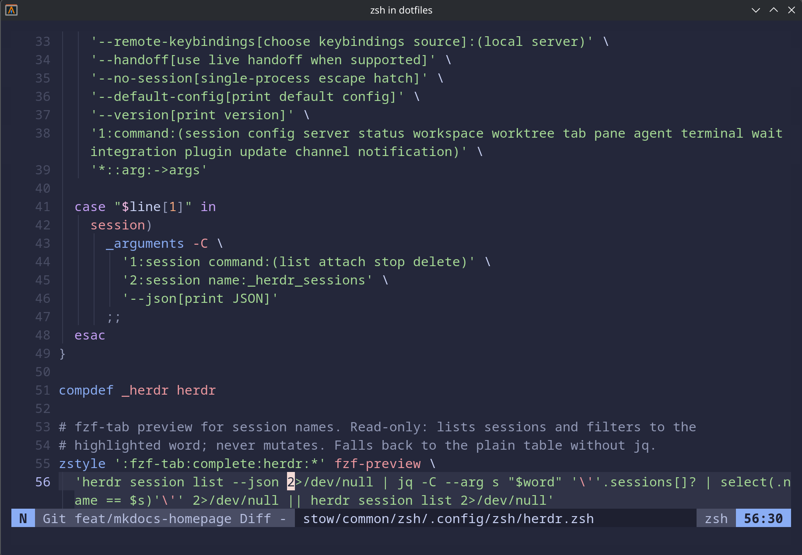

# Editor (Neovim)

The `stow/common/nvim/` package provides a [kickstart.nvim](https://github.com/nvim-lua/kickstart.nvim)-based
Neovim configuration, themed Catppuccin Macchiato (blue accent `#8aadf4`) to match the rest of the
terminal. It's meant to replace plain `vim` for quick local edits and server maintenance, while still
being a full, learnable setup.

Curated from `stow/common/nvim/README.md`. There is no separate setup guide for this package yet.


*Neovim editing inside the dotfiles repository.*

## What it configures

- Stock kickstart `init.lua`, kept close to upstream (LSP servers + treesitter languages edited).
- Plugins managed by [lazy.nvim](https://github.com/folke/lazy.nvim), pinned via `lazy-lock.json`.
- Feature files under `lua/custom/plugins/`: Catppuccin colorscheme, snacks picker, neo-tree file
  explorer, flash jump motions, indent guides, and filetype scoping.

Target path is `~/.config/nvim` (XDG), identical on macOS, Arch, and Debian — only the system
dependencies differ per platform.

## Dependencies

LSP servers are installed **inside** Neovim by [Mason](https://github.com/mason-org/mason.nvim)
(`:Mason`), but they need runtimes and a few CLI tools on the system first — `neovim`, `ripgrep`,
`fd`, `node`, `python` + `pipx`, a C compiler, and the `tree-sitter` CLI.

Print the install commands (nothing installs automatically):

```bash
task deps:brew    # macOS
task deps:arch    # Arch
```

!!! info "tree-sitter CLI"
    nvim-treesitter builds parsers by shelling out to the `tree-sitter` binary. On macOS, Homebrew's
    `tree-sitter` formula ships the library only, so install the CLI via `npm install -g tree-sitter-cli`.
    Without it, parser builds fail with `ENOENT ... (cmd): 'tree-sitter'`. See the package README for
    the full rationale.

## Install

This package uses the standard Stow workflow (no `--no-folding` needed):

```bash
stow --dir=stow/common --target="$HOME" --simulate nvim
```

⚠️  MANUAL STEP — review dry-run output before running

```bash
stow --dir=stow/common --target="$HOME" nvim
```

## Related

- [Shell Dependencies](../reference/shell-dependencies.md) · [GNU Stow Workflow](../reference/stow.md)
