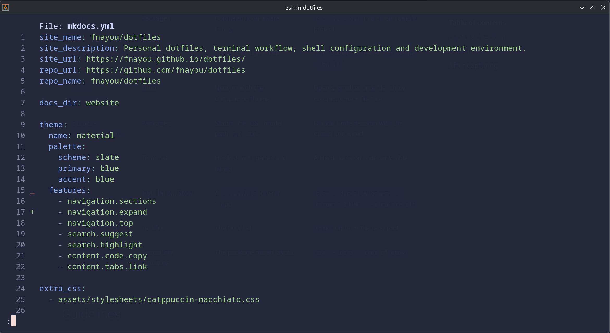
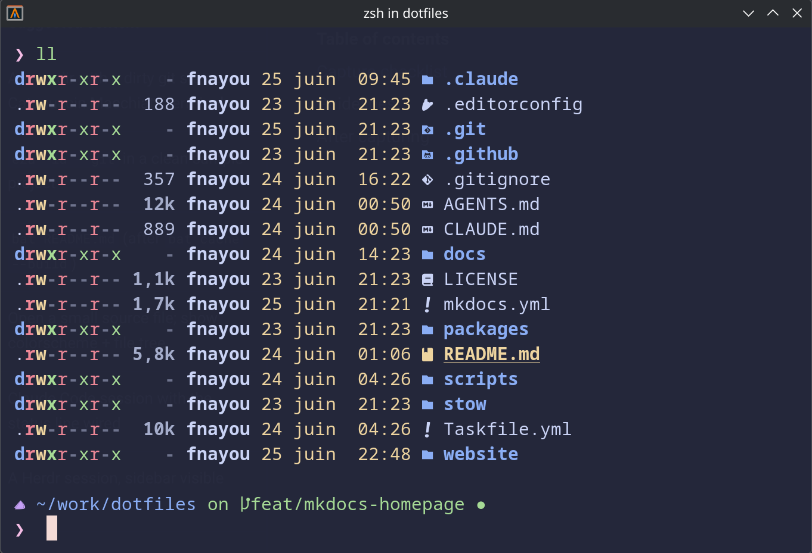
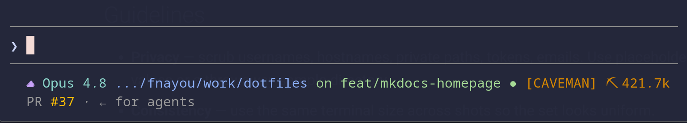

# Packages

A handful of small CLI tools, each in its own Stow package, that make daily terminal work nicer. All
share the Catppuccin Macchiato (blue) look. Install only the ones you want — every package is
independent.

Curated from the bat, eza, claude, and omp setup guides / READMEs.

## bat — a better `cat`

`stow/common/bat/` themes [bat](https://github.com/sharkdp/bat) (syntax-highlighted file viewer) with
Catppuccin Macchiato. In daily use it's a readable pager for source and logs; the zsh package also
wires `.md` / `.txt` / `.log` suffix aliases to it.


*Syntax-highlighted file preview with bat.*

!!! note "One activation step"
    bat reads themes from a compiled cache. After stowing, build it once:

    ```bash
    bat cache --build
    bat --list-themes | grep "Catppuccin Macchiato"
    ```

## eza — a better `ls`

`stow/common/eza/` ships a Catppuccin Macchiato (Blue) theme for [eza](https://github.com/eza-community/eza).
No cache step — the theme applies as soon as it's stowed. The `ls` / `ll` / `la` / `lt` aliases live
in the zsh package. Quick check after stowing:

```bash
eza -la --git
```


*Icon-aware project listing powered by eza.*

## Claude Code status line

`stow/common/claude/` provides a status line script for [Claude Code](https://code.claude.com),
rendering **OS icon · model · path · git branch+status · context %** in the same palette as the
prompt. It needs `jq`, `git`, and a Nerd Font.


*Claude Code status line integrated into the terminal workflow.*

!!! warning "`~/.claude` holds secrets — stow carefully"
    Only `statusline-command.sh` is managed; credentials and session data in `~/.claude` are never
    tracked. This package requires `--no-folding`, and on most machines the dry-run reports a conflict
    (Claude Code already wrote a real script there) — resolve it manually, never with `--adopt`. See
    the repository's `docs/guides/claude-setup.md` for the wiring step in `~/.claude/settings.json`.

## Oh My Posh prompt

`stow/common/omp/` holds the [Oh My Posh](https://ohmyposh.dev/) theme (`omp.toml`) — prompt segments
(path, git, status) in the Catppuccin Macchiato palette. The zsh package initialises it; `omp` is the
theme source of truth that the Claude status line mirrors. Stow it with the standard workflow:

```bash
stow --dir=stow/common --target="$HOME" --simulate omp
```

## Related

- [Shell (Zsh)](shell.md) — aliases and prompt integration.
- [GNU Stow Workflow](../reference/stow.md) · [Installation](../installation.md)
