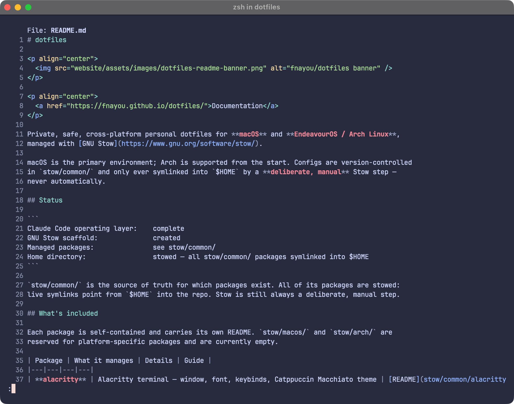
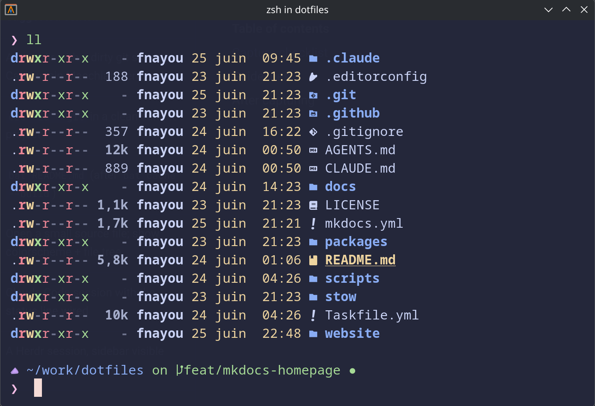
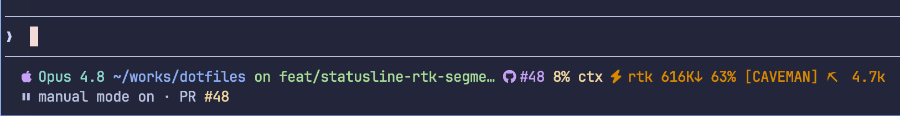

# Packages

A handful of small CLI tools, each in its own Stow package, that make daily terminal work nicer. All
share the Catppuccin Macchiato (blue) look. Install only the ones you want — every package is
independent.

Curated from the bat, eza, claude, and omp setup guides / READMEs.

## bat — a better `cat`

`stow/common/bat/` themes [bat](https://github.com/sharkdp/bat) (syntax-highlighted file viewer) with
Catppuccin Macchiato. In daily use it's a readable pager for source and logs; the zsh package also
wires `.md` / `.txt` / `.log` suffix aliases to it.


*Syntax-highlighted file preview with bat.*

!!! note "One activation step"
    bat reads themes from a compiled cache. After stowing, build it once:

    ```bash
    bat cache --build
    bat --list-themes | grep "Catppuccin Macchiato"
    ```

## eza — a better `ls`

`stow/common/eza/` ships a Catppuccin Macchiato (Blue) theme for [eza](https://github.com/eza-community/eza).
No cache step — the theme applies as soon as it's stowed. The `ls` / `ll` / `la` / `lt` aliases live
in the zsh package. Quick check after stowing:

```bash
eza -la --git
```


*Icon-aware project listing powered by eza.*

## btop — resource monitor

`stow/common/btop/` themes [btop](https://github.com/aristocratos/btop) (interactive resource
monitor) with Catppuccin Macchiato. It manages `btop.conf` (active theme, terminal-transparent
background, truecolor, vim keys) plus the theme file. No cache step — like eza, the theme applies as
soon as it's stowed and btop is restarted.

```bash
stow --dir=stow/common --target="$HOME" --no-folding --simulate btop
```

!!! note "Accent is already blue"
    The [catppuccin/btop](https://github.com/catppuccin/btop) port ships one theme per flavor — there
    is no separate accent selector. The Macchiato theme already uses **Blue** (`#8aadf4`) for
    highlights, the selected process row, and the process-box outline.

## Claude Code status line

`stow/common/claude/` provides a status line script for [Claude Code](https://code.claude.com),
rendering **OS icon · model · path · git branch+status · PR/MR · context %** in the same palette
as the prompt. It needs `jq`, `git`, and a Nerd Font. The path collapses to its last 3 components
when deep, and the **PR/MR** segment shows the open request for the current branch — GitHub via
`gh` (`#` sigil) or GitLab via `glab` (`!` sigil), detected from the `origin` remote and cached in
the background. Set `STATUSLINE_NERD_FONT=0` to swap the forge glyph for an ASCII `PR`/`MR` label.


*Claude Code status line integrated into the terminal workflow.*

Two **optional** trailing segments light up only when their tool is present — each is
guarded, so a missing tool renders nothing (no error, no placeholder):

- **rtk savings** — tokens saved + average savings % for the current directory
  (exact cwd, not the whole repo), via the [rtk](https://github.com/rtk-ai/rtk)
  CLI (`rtk gain --project --format json`).
- **caveman badge** — the `[CAVEMAN]` mode badge + savings suffix from the
  [caveman](https://github.com/JuliusBrussee/caveman) Claude Code plugin. The script
  doesn't reimplement it; it calls caveman's own hardened statusline script, located
  by glob (the plugin's install path and cache hash vary per release). The badge shows
  when caveman is installed **and** active (`/caveman full`). See the package
  [README](https://github.com/fnayou/dotfiles/blob/main/stow/common/claude/README.md)
  for the exact glob paths and wiring.

!!! warning "`~/.claude` holds secrets — stow carefully"
    Only `statusline-command.sh` is managed; credentials and session data in `~/.claude` are never
    tracked. This package requires `--no-folding`, and on most machines the dry-run reports a conflict
    (Claude Code already wrote a real script there) — resolve it manually, never with `--adopt`. See
    the repository's `docs/guides/claude-setup.md` for the wiring step in `~/.claude/settings.json`.

## Oh My Posh prompt

`stow/common/omp/` holds the [Oh My Posh](https://ohmyposh.dev/) theme (`omp.toml`) — prompt segments
(path, git, status) in the Catppuccin Macchiato palette. The zsh package initialises it; `omp` is the
theme source of truth that the Claude status line mirrors. Stow it with the standard workflow:

```bash
stow --dir=stow/common --target="$HOME" --simulate omp
```

## Related

- [Shell (Zsh)](shell.md) — aliases and prompt integration.
- [GNU Stow Workflow](../reference/stow.md) · [Installation](../installation.md)
