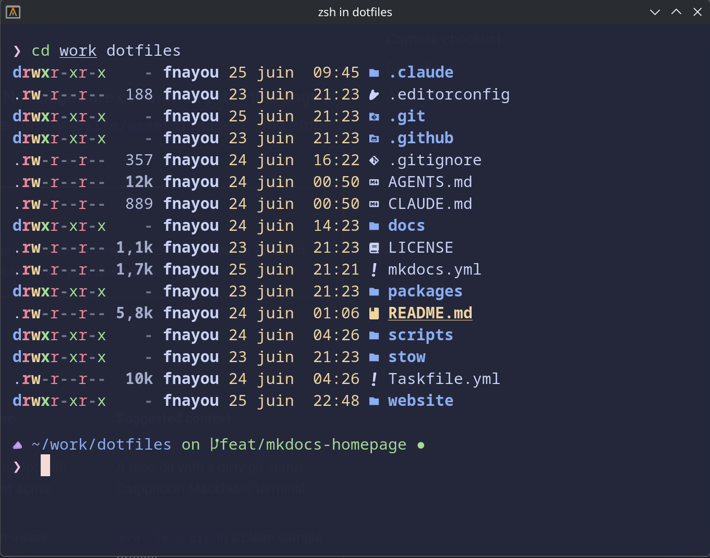

# Shell (Zsh)

The `stow/common/zsh/` package manages a layered Zsh configuration under `~/.config/zsh/`. After
stowing, `~/.config/zsh/` is a **real directory** and each managed file inside it is a per-file
symlink into the repository.

This page is curated from the repository's `docs/guides/zsh-setup.md`.


*Shell prompt with Git context and Catppuccin Macchiato colors.*

!!! warning "`~/.zshrc` stays yours"
    This package never stows, overwrites, or reads `~/.zshrc`. After stowing, you add **one guarded
    include block** to your own `~/.zshrc` to source the managed config. Your existing shell startup
    is preserved.

## Layered structure

`index.zsh` is the entry point — it sources each layer in order. Layers separate concerns so a single
file owns a single job:

| Layer | Responsibility |
|---|---|
| `shared.zsh` | XDG vars + portable env (`EDITOR`, `PAGER`) |
| `path.zsh` | PATH additions (`$HOME`-relative, safe) |
| `history.zsh` | HISTFILE, HISTSIZE, SAVEHIST, history options |
| `plugins.zsh` | Zinit guarded source; owns plugin order + `compinit` |
| `fzf.zsh` | fzf shell integration (no-op without `fzf`) |
| `completions.zsh` | Completion styles + fzf-tab previews |
| `taskfile.zsh` | `task <Tab>` completion tuning (no-op without `task`) |
| `herdr.zsh` | `herdr <Tab>` session-name completion (no-op without `herdr`) |
| `keybindings.zsh` | Key bindings |
| `aliases.zsh` | Portable aliases |
| `tools.zsh` | zoxide integration (guarded) |
| `prompt.zsh` | Oh My Posh (double-guarded; no-op if missing) |
| `macos.zsh` / `arch.zsh` | Per-OS layers, runtime-selected |

!!! info "Private overrides go in `local.zsh`"
    `local.zsh.example` is a skeleton you copy to `~/.config/zsh/local.zsh` for private,
    machine-specific content. `local.zsh` is git-ignored and lives outside the repository working tree —
    it is never committed.

## Prompt

The prompt comes from **Oh My Posh** via the separate `stow/common/omp/` package (Catppuccin Macchiato
palette). The zsh package works without it: `prompt.zsh` is double-guarded and is a no-op when
`oh-my-posh` is not installed or `omp.toml` is missing. Stow `omp` separately if you want the prompt.

## Aliases and tool integrations

Aliases live in `aliases.zsh` (portable) with tool-specific behaviour gated behind `command -v`:

- `eza` provides `ls` / `ll` / `tree`-style aliases when installed.
- `bat` adds suffix aliases (`.md`, `.txt`, `.log`) for file preview.
- `zoxide` powers a smarter `cd`.
- `fzf` drives fuzzy completion and fzf-tab previews.

Each integration disappears cleanly if its tool is absent.

## Completions

Tab completion is layered on top of Zsh's `compinit` (run once in `plugins.zsh`). When the optional
plugins are installed via Zinit, the setup adds:

- **`zsh-completions`** — extra completion definitions, loaded onto `fpath` before `compinit`.
- **`fzf-tab`** — replaces the completion menu with an fzf picker. `completions.zsh` adds previews:
  directory completions preview with `eza`, file completions with `bat` (falling back to `ls` / `cat`
  when those tools are absent).
- **`task` completion** — `taskfile.zsh` tunes the native `_task` completion shipped by the go-task
  package, showing task descriptions and a read-only summary preview. No-op without `task`.
- **`herdr` completion** — `herdr.zsh` authors session-name completion for `herdr <Tab>` (Herdr ships
  no native completion), using the read-only `herdr session list`. No-op without `herdr`.

!!! note "All guarded, all read-only"
    Each completion layer is gated behind `command -v` and is skipped when its tool is missing. The
    `task` and `herdr` previews only read state — they never run a task or mutate a session. The
    plugins themselves require Zinit and `fzf`; see [Shell Dependencies](../reference/shell-dependencies.md).

## Dependencies

Required before stowing: `zsh`, `stow`, `git`. Everything else is optional and guarded — see
[Shell Dependencies](../reference/shell-dependencies.md) for the full tier table and install commands,
and check your machine with:

```bash
task deps:check:zsh
```

## Stowing the package

Dry-run first. This package requires `--no-folding` (and `task dry-run` does **not** pass it, so use
the direct command):

```bash
stow --dir=stow/common --target="$HOME" --no-folding --simulate zsh
```

Look for `LINK:` lines for each managed file, and no `CONFLICT` / `WARNING` lines. Then apply:

⚠️  MANUAL STEP — review dry-run output before running

```bash
stow --dir=stow/common --target="$HOME" --no-folding zsh
```

After stowing, add the include block to `~/.zshrc` (see `docs/guides/zsh-setup.md` for the exact block)
and start a new shell.

!!! warning "Not claimed portable beyond macOS + Arch"
    The layered config is tested on macOS (primary) and EndeavourOS / Arch Linux. Elsewhere, read it as
    a reference and adapt rather than expecting a drop-in install.

## Related

- [Shell Dependencies](../reference/shell-dependencies.md) · [GNU Stow Workflow](../reference/stow.md) · [Installation](../installation.md)
