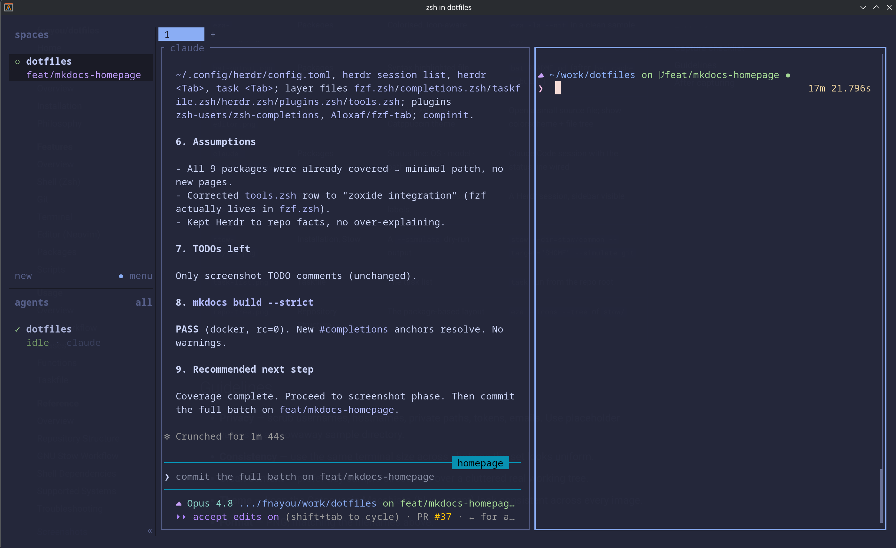

# Terminal

Two packages shape the terminal: **Alacritty** (the emulator) and **Herdr** (an agent-oriented
multiplexer). Both ship a Catppuccin Macchiato look with a blue accent, consistent with the rest of
the setup.

Curated from `docs/guides/alacritty-setup.md` and `docs/guides/herdr-setup.md`.

## Alacritty

The `stow/common/alacritty/` package manages two files in `~/.config/alacritty/`:

| File | Purpose |
|---|---|
| `alacritty.toml` | Window, font, keybindings, shell, theme import |
| `catppuccin-macchiato.toml` | Catppuccin Macchiato color theme |

Alacritty loads the config on startup — no activation step beyond stowing.

!!! note "macOS-specific lines are harmless on Linux"
    `decorations = "Buttonless"` and `option_as_alt = "Both"` only affect macOS. Alacritty ignores
    inapplicable values gracefully on Arch.

Dry-run, then apply (requires `--no-folding`):

```bash
stow --dir=stow/common --target="$HOME" --no-folding --simulate alacritty
```

⚠️  MANUAL STEP — review dry-run output before running

```bash
stow --dir=stow/common --target="$HOME" --no-folding alacritty
```

## Herdr

The `stow/common/herdr/` package manages a single file, `~/.config/herdr/config.toml` — theme,
terminal, UI, and toast settings. Herdr is an agent-oriented multiplexer; it loads
`~/.config/herdr/config.toml` automatically on startup, so there's no activation step beyond stowing.
The default shell is `zsh` and new panes follow the active pane's working directory.

The zsh package also ships **Herdr session-name completion** (`herdr <Tab>`) — see
[Completions](shell.md#completions).


*Herdr session layout for agent-oriented terminal work.*

!!! warning "Only `config.toml` is managed"
    Herdr also keeps session state and workspace data under `~/.config/herdr/`. The package manages
    **only** `config.toml`. Never remove the whole `~/.config/herdr/` directory — if there's an
    existing `config.toml`, back up and remove just that one file before stowing.

Dry-run, then apply (requires `--no-folding`):

```bash
stow --dir=stow/common --target="$HOME" --no-folding --simulate herdr
```

⚠️  MANUAL STEP — review dry-run output before running

```bash
stow --dir=stow/common --target="$HOME" --no-folding herdr
```

## Related

- [Shell (Zsh)](shell.md) — the prompt and shell that run inside the terminal.
- [GNU Stow Workflow](../reference/stow.md) · [Installation](../installation.md)
