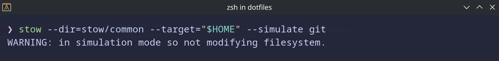

# Installation

This page describes the safe way to install packages from this repository. The approach is the same
everywhere: install the tools you need, **dry-run**, review, then install one package at a time.

!!! warning "Manual by design"
    Nothing here runs automatically. There is no bootstrap script that installs everything. Each command
    is something you run yourself after reviewing it. Commands that change your system are marked.

## How installation works

The repository uses [GNU Stow](https://www.gnu.org/software/stow/) with a **package-based layout**.
Each package under `stow/common/` is a directory whose contents mirror your home directory. Stowing a
package creates symlinks in `$HOME` pointing back into the repository.

```
stow/
  common/     # works on macOS, Arch, and Debian (source of truth)
  macos/      # macOS-only packages (currently empty)
  arch/       # Arch / EndeavourOS-only packages (currently empty)
  debian/     # Debian-only packages (currently empty)
```

## Dependencies

The packages depend on a small set of tools. Two are required; the rest are optional and the shell
config starts cleanly without them.

| Tool | Used by | Required? |
|---|---|---|
| `git` | repository management | Yes |
| `stow` | symlink manager | Yes |
| [`go-task`](https://taskfile.dev/) | task runner; powers `task <Tab>` completion | Yes |
| `fzf`, `zoxide`, `eza`, `bat`, `oh-my-posh`, `zinit`, `herdr` | shell/tooling enhancements | Optional |

Install commands per platform (from the repository's packages guide):

=== "macOS"

    ⚠️  MANUAL STEP — review `brew bundle list` output before running

    ```bash
    # Preview, then install the full set from the repo's Brewfile
    brew bundle list --file=packages/Brewfile
    brew bundle --file=packages/Brewfile
    ```

=== "Arch / EndeavourOS"

    ⚠️  MANUAL STEP — review before running

    ```bash
    sudo pacman -S git stow go-task fzf zoxide eza bat
    # oh-my-posh is AUR-only:
    yay -S oh-my-posh-bin
    ```

=== "Debian (trixie / 13+)"

    ⚠️  MANUAL STEP — review before running

    ```bash
    sudo apt install git stow fzf zoxide eza bat
    # Binary names differ on Debian: bat -> batcat, fd -> fdfind
    # go-task and oh-my-posh are NOT in the Debian archive — install out-of-band:
    sh -c "$(curl -fsSL https://taskfile.dev/install.sh)" -- -d -b ~/.local/bin   # go-task
    curl -s https://ohmyposh.dev/install.sh | bash -s                              # oh-my-posh
    ```

    See `packages/debian/packages.txt` and `task deps:debian` for the full annotated list,
    including the Neovim tier (where `tree-sitter` and, if apt's neovim is too old, neovim itself
    come from a prebuilt binary).

Want only specific tools? Install them individually — every optional tool is guarded in the zsh config
and silently skipped when absent. See the repository's packages guide for the selective-install list and
the `zinit` clone step.

Verify what's installed:

```bash
task deps:check:zsh
```

## Install a package

### Step 1 — list packages

```bash
task list
```

Output is `<area>/<package>` (for example `common/git`).

### Step 2 — dry-run (mandatory)

The dry-run shows exactly what Stow *would* do, without changing anything. Always do this first.

```bash
task dry-run AREA=common PACKAGE=git
```

Or directly:

```bash
stow --dir=stow/common --target="$HOME" --simulate git
```

Read the output carefully. If anything looks unexpected, stop and investigate.

### Step 3 — install

Only after the dry-run looks correct. Install one package at a time.

⚠️  MANUAL STEP — review the dry-run output before running

```bash
stow --dir=stow/common --target="$HOME" git
```

!!! danger "Never use `--adopt`"
    `--adopt` silently overwrites existing files with the repository version and cannot be undone. It is
    forbidden in this repository. If a dry-run reports a conflict, resolve it manually instead — see
    [Troubleshooting](reference/troubleshooting.md).

## Package bootstrap helpers

Some packages (git, zsh) need a one-time local file created before stowing. The repository provides
dry-run-able task helpers for these:

```bash
task git:bootstrap:dry-run
task zsh:bootstrap:dry-run
```

<!-- TODO: confirm and document the exact post-dry-run apply steps for git:bootstrap / zsh:bootstrap from docs/guides/{git,zsh}-setup.md when migrating the Features pages. -->

## Full detail

The complete dry-run / install / conflict-handling workflow lives in the
[GNU Stow Workflow](reference/stow.md) reference page, adapted from the repository's own Stow usage
guide.


*GNU Stow simulation before applying a package.*
