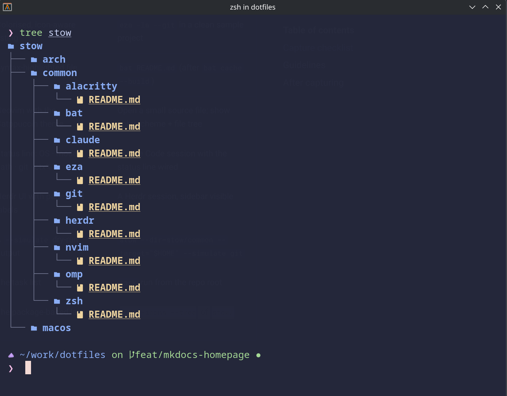

# Repository Structure

A map of the repository from a visitor's perspective — what each top-level entry is for, and which
parts are meant for public reuse versus internal project history.

```
dotfiles/
├── README.md          # Repository overview + package table (GitHub landing)
├── AGENTS.md          # Internal operating contract (for automation; not part of this site)
├── Taskfile.yml       # go-task targets: list, dry-run, deps checks, bootstraps
├── mkdocs.yml         # Configuration for this documentation site
├── stow/              # The actual dotfiles, as Stow packages (source of truth)
│   ├── common/        # Works on macOS and Arch
│   ├── macos/         # macOS-specific (currently empty)
│   └── arch/          # Arch / EndeavourOS-specific (currently empty)
├── packages/          # Dependency manifests (Brewfile, arch/packages.txt)
├── scripts/           # Helper scripts (dependency checks, maintenance)
├── docs/              # Internal project documentation (kept as-is)
├── website/           # Public documentation source — this site
└── .github/           # GitHub Actions workflows (CI + docs deploy)
```

## What each part is

| Entry | Purpose | For visitors |
|---|---|---|
| `README.md` | Repository overview and the package table | Start here on GitHub |
| `docs/` | Internal AI/process/project notes — PRDs, plans, reviews, decisions, guides | Source material; **not published to this site** |
| `website/` | The Markdown source for this documentation site | **This is the public docs source** |
| `stow/` | The configuration itself, organised as Stow packages | The thing you read, copy, or stow |
| `Taskfile.yml` | [go-task](https://taskfile.dev/) targets for listing, dry-running, and checking deps | Run `task list` to explore |
| `.github/` | GitHub Actions — hygiene CI and the Pages deploy workflow | Nothing to run yourself |

!!! info "`docs/` vs `website/`"
    `docs/` holds the repository's **internal** documentation — the product requirements, plans,
    reviews, and decision records produced while building the setup. This site is **curated** from that
    material and lives in `website/`; the internal notes are not republished here verbatim. If you want
    the full project history, read `docs/` directly in the repository.

!!! note "`stow/` is the source of truth"
    The `stow/common/` directory defines which packages exist. Each package is self-contained and
    carries its own `README.md`. `stow/macos/` and `stow/arch/` are reserved for platform-specific
    packages and are currently empty.


*Package-based repository layout under stow/.*

## Related

- [Getting Started](../getting-started.md) — how to approach the repository.
- [GNU Stow Workflow](stow.md) — how the `stow/` packages become symlinks.
- [Features](../features/index.md) — what each package configures.
