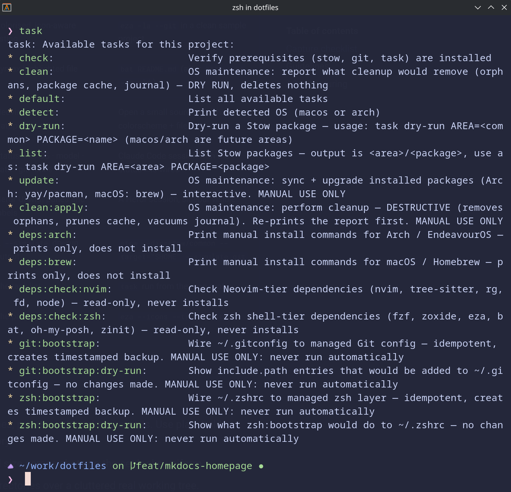

# Taskfile

The repository uses [go-task](https://taskfile.dev/) as its command entrypoint. `Taskfile.yml` wraps the
common operations — listing packages, dry-running Stow, checking dependencies, bootstrapping config, and
OS maintenance — so you run short, consistent commands instead of remembering flags.


*Taskfile entrypoint listing safe checks, dry-runs, and maintenance commands.*

## Discovering tasks

```bash
task          # list all available tasks (the default task)
```

!!! info "`task` vs `task list`"
    `task` (the default) lists **tasks**. `task list` lists **Stow packages** as `<area>/<package>`, for
    use with `task dry-run`. They're different — don't confuse them.

## Safe, read-only tasks

These never modify your system — they inspect, check, or print:

| Task | What it does |
|---|---|
| `task` | List all available tasks |
| `task detect` | Print detected OS (`macos` or `arch`) |
| `task check` | Verify prerequisites (`stow`, `git`, `task`) are installed |
| `task list` | List Stow packages |
| `task dry-run AREA=<area> PACKAGE=<name>` | Dry-run a Stow package (simulation, no changes) |
| `task deps:check:zsh` | Check zsh shell-tier deps (fzf, zoxide, eza, bat, oh-my-posh, zinit) |
| `task deps:check:nvim` | Check Neovim-tier deps (nvim, tree-sitter, rg, fd, node) |
| `task deps:brew` | Print macOS / Homebrew install commands (prints only) |
| `task deps:arch` | Print Arch / EndeavourOS install commands (prints only) |
| `task clean` | Report what OS cleanup *would* remove — dry-run, deletes nothing |
| `task git:bootstrap:dry-run` | Show include entries that *would* be added to `~/.gitconfig` |
| `task zsh:bootstrap:dry-run` | Show what `zsh:bootstrap` *would* do to `~/.zshrc` |

Example dry-run:

```bash
task dry-run AREA=common PACKAGE=git
```

## System-modifying tasks

These change your system or home config. Each is marked **MANUAL USE ONLY** in the Taskfile and creates a
backup where it edits an existing file. Run the matching dry-run first.

| Task | What it does |
|---|---|
| `task update` | Sync + upgrade packages (Arch: yay/pacman, macOS: brew) — interactive |
| `task clean:apply` | Perform OS cleanup — **destructive** (orphans, cache, journal); re-prints report first |
| `task git:bootstrap` | Wire `~/.gitconfig` to managed Git config — idempotent, timestamped backup |
| `task zsh:bootstrap` | Wire `~/.zshrc` to the managed zsh layer — idempotent, timestamped backup |

⚠️  MANUAL STEP — review the matching dry-run output before running any task in this table

!!! note "Nothing installs automatically"
    Even the `deps:*` tasks only check or print commands — no task in this repository installs software or
    runs Stow on its own. Installation and stowing are always your own deliberate steps.

## Related

- [Installation](../installation.md) · [GNU Stow Workflow](../reference/stow.md) · [Shell Dependencies](../reference/shell-dependencies.md)
